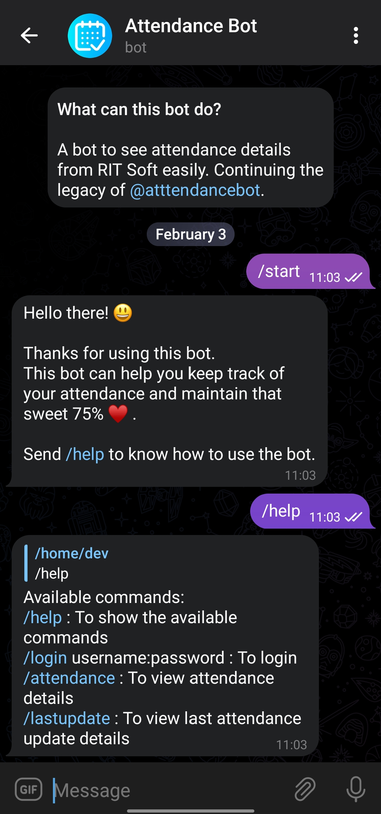
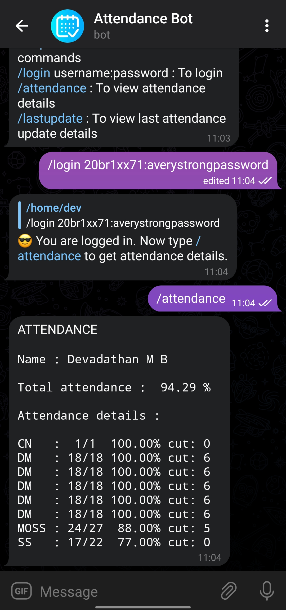
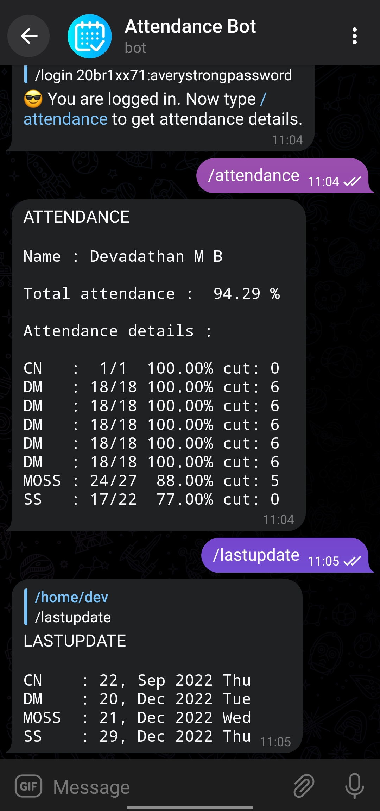
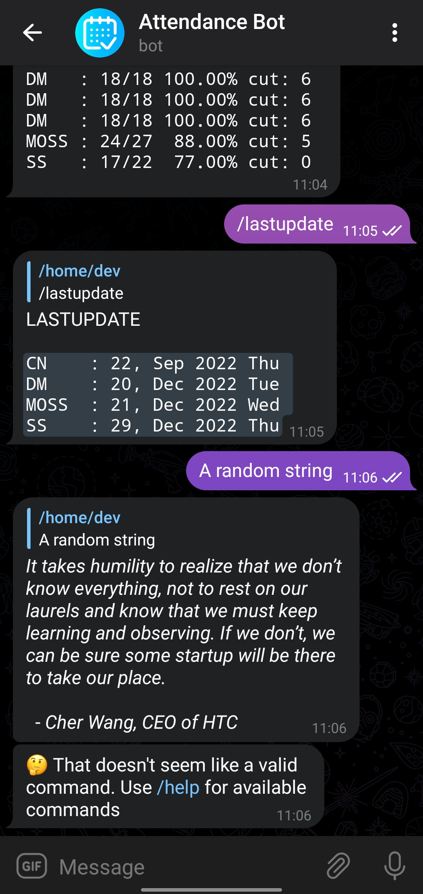

<h1 align="center"> Attendance Bot 
 </h1>
<p align="center">
<i>A bot to continue the legacy of now dead <a href="https://t.me/atttendancebot"> Attendance Bot</a></i>
<br>
<br>
Find the bot <a href="https://t.me/rit_attendancebot"> here<a/>.
</p>


## What does this bot do?
As said above, this bot helps you see your attendance details published in [RIT Soft]() just with a few commands. I found that the popular [bot]() is now not working anymore so I decided to make my own.

## Previews

<br>

<br>

<br>


## Bot usage

See the available commands to see how to use the bot.

### Bot commands
```
/start - To start the bot

/login username:password - To login and create a new session.

/attendance - See attendance details.

/lastupdate - See lastupdate details.

/help - Help me!
```

## Development
To run this on your own development environment, do the following steps.

### Using docker
1. Make sure docker is installed on your machine.
2. Clone the repository
```bash
git clone https://github.com/devadathanmb/attendance-bot
```
3. Create a `.env` file in the cloned directory and setup the environment variables (see [env.example](file) for more info.)
4. Build your docker image using
```bash
docker build -t <your bot name> attendance-bot/
```
5. Run the built docker image using
```bash
docker run <your app name>
```

### Without docker

It's almost the same steps as above.

1. Make sure `node, npm, git` is installed on your machine.
2. Clone the repository.
```bash
git clone https://github.com/devadathanmb/attendance-bot
```
3. Change directory into the cloned repository
```bash
cd attendance-bot
```
4. Install the required dependencies
```bash
npm install
```
5. Create a `.env` file and setup the environment variables (see [env.example](file) for more info.)
6. Run the bot using 
```bash
nodemon app.js --ignore sessions.json
```

## Acknowledgements
- Thanks to [icons8](https://icons8.com) and [flaticon](https://www.flaticon.com/) for the icons.
